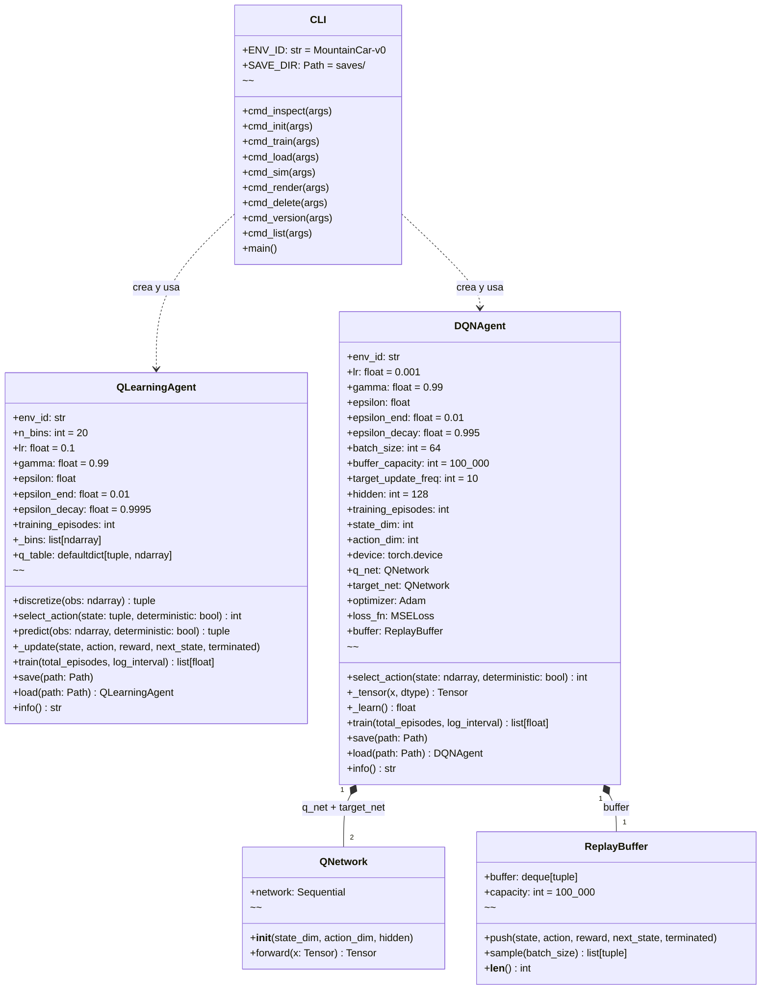
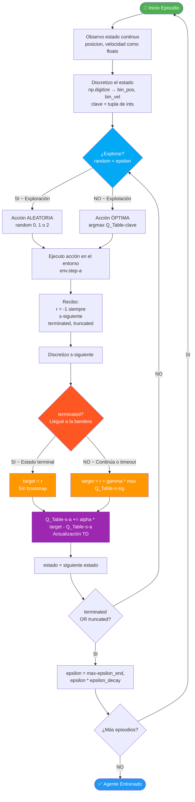
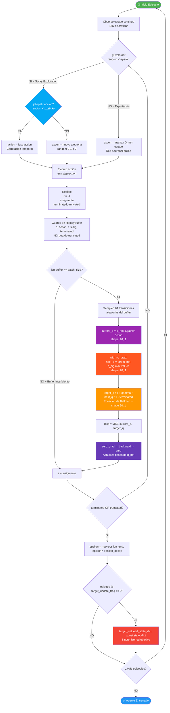

# Guía Conceptual ~ Aprendizaje por Refuerzo con MountainCar

> **Nota personal:** Este documento es mi guía de estudio para entender el proyecto
> MountainCar-v0 a fondo. Lo escribí explicándome cada concepto desde lo más básico
> hasta el análisis línea a línea del código, porque entender el código es tan
> importante como entender la teoría. Si entiendo esto, entiendo RL ~ "Reinforcement
> Learning ~ Aprendizaje por Refuerzo" de verdad.

---

## Tabla de Contenidos

1. [¿Qué es el Aprendizaje por Refuerzo?](#1-qué-es-el-aprendizaje-por-refuerzo)
2. [El Entorno MountainCar-v0](#2-el-entorno-mountaincar-v0)
3. [Agente 1 ~ Q-Learning Tabular](#3-agente-1--q-learning-tabular)
4. [Agente 2 ~ DQN ~ Deep Q-Network](#4-agente-2--dqn--deep-q-network)
5. [El Bug de Exploración ~ Por qué DQN no aprende solo](#5-el-bug-de-exploración--por-qué-dqn-no-aprende-solo)
6. [Análisis Profundo del Código ~ qlearning.py](#6-análisis-profundo-del-código--qlearningpy)
7. [Análisis Profundo del Código ~ dqn.py](#7-análisis-profundo-del-código--dqnpy)
8. [Distinción Crítica ~ terminated vs truncated](#8-distinción-crítica--terminated-vs-truncated)
9. [Shapes de Tensores en DQN ~ El Bug Silencioso](#9-shapes-de-tensores-en-dqn--el-bug-silencioso)
10. [El Sistema de Guardado y Carga](#10-el-sistema-de-guardado-y-carga)
11. [Flujo Completo de la CLI](#11-flujo-completo-de-la-cli)
12. [Diagrama del Proyecto ~ Clases y Funciones](#12-diagrama-del-proyecto--clases-y-funciones)
13. [Diagrama ~ Ciclo de Entrenamiento Q-Learning](#13-diagrama--ciclo-de-entrenamiento-q-learning)
14. [Diagrama ~ Ciclo de Entrenamiento DQN](#14-diagrama--ciclo-de-entrenamiento-dqn)
15. [Comparación entre Q-Learning y DQN](#15-comparación-entre-q-learning-y-dqn)
16. [Glosario de Acrónimos](#16-glosario-de-acrónimos)

---

## 1. ¿Qué es el Aprendizaje por Refuerzo?

### La idea con palabras de todos los días

Imagina que tienes un perro al que quieres enseñarle a sentarse. Cada vez que
se sienta le das un premio (recompensa positiva). Cada vez que salta encima de
ti, no le das nada (recompensa cero o negativa). Con el tiempo el perro aprende
que sentarse = premio, y lo hace cada vez más.

El RL ~ "Reinforcement Learning ~ Aprendizaje por Refuerzo" funciona exactamente
igual, pero en vez de un perro tenemos un **agente** ~ "agent ~ programa que toma
decisiones", y en vez del mundo real tenemos un **entorno** ~ "environment ~
simulación del mundo donde el agente actúa".

### Los 5 ingredientes de RL

```
┌─────────────────────────────────────────────────────────────────────┐
│                    EL CICLO DE RL ~ Reinforcement Learning          │
│                                                                     │
│   ┌──────────┐   acción a(t)   ┌─────────────┐                     │
│   │  AGENTE  │ ──────────────► │   ENTORNO   │                     │
│   │ (agent)  │                 │(environment)│                     │
│   │          │ ◄────────────── │             │                     │
│   └──────────┘  estado s(t+1)  └─────────────┘                     │
│                 recompensa r(t)                                     │
└─────────────────────────────────────────────────────────────────────┘
```

| Ingrediente | Símbolo | En palabras simples |
|---|:---:|---|
| **Agente** ~ Agent | ~ | El "jugador" que toma decisiones |
| **Entorno** ~ Environment | ~ | El "juego" donde actúa |
| **Estado** ~ State | s | Una "foto" de la situación actual |
| **Acción** ~ Action | a | Lo que el agente decide hacer |
| **Recompensa** ~ Reward | r | El "punto" o "castigo" que recibe |
| **Política** ~ Policy | π | La "regla" que dice qué hacer en cada estado |
| **Descuento** ~ Discount | γ (gamma) | Cuánto importan las recompensas futuras |

### ¿Qué maximiza el agente?

El **retorno** G ~ "cumulative discounted reward ~ suma de recompensas futuras
descontadas":

```
G(t) = r(t) + γ·r(t+1) + γ²·r(t+2) + γ³·r(t+3) + ...
```

Con γ=0.99 (el valor que usamos), las recompensas futuras importan casi tanto
como las inmediatas. Con γ=0, solo importa la recompensa inmediata (agente
"miope"). Con γ=1, todas las recompensas futuras importan igual (peligroso en
episodios largos porque G podría ser infinito).

---

## 2. El Entorno MountainCar-v0
https://www.youtube.com/watch?v=_SWnNhM5w-g

### La situación visual

```
                        🚩  ← Meta: posición x ≥ 0.5
                       /|
                      / |
                     /  |
    ____________    /   altura
   /            \  /    |
  /    valle     \/     |
 /         🚗 ← coche empieza aquí (x ≈ -0.6, v ≈ 0)
/
│
└── eje x: de -1.2 (izquierda) a 0.6 (derecha)
```

El motor del coche es demasiado débil para subir directo. Debe balancearse
hacia atrás y adelante, como un columpio, para acumular energía cinética ~
"kinetic energy ~ energía del movimiento" y llegar a la meta.

### El espacio de observación ~ Observation Space

Cada vez que el agente observa el entorno recibe exactamente **2 números**:

| Índice | Variable | Rango | Interpretación |
|:---:|---|---|---|
| 0 | Posición x | [-1.2, 0.6] | Qué tan a la izquierda/derecha está |
| 1 | Velocidad v | [-0.07, 0.07] | Qué tan rápido va y hacia dónde |

Ejemplo de observación: `[-0.4823, 0.0021]` ~ el coche está ligeramente a
la izquierda del centro, moviéndose muy lentamente hacia la derecha.

### El espacio de acciones ~ Action Space

| Valor | Acción | Efecto |
|:---:|---|---|
| 0 | ← Acelerar izquierda | Empuja hacia atrás (construye momentum hacia izquierda) |
| 1 | Sin aceleración | No hace nada (el coche rueda con gravedad) |
| 2 | → Acelerar derecha | Empuja hacia adelante (construye momentum hacia derecha) |

### Las recompensas ~ Rewards (LO MÁS IMPORTANTE)

| Evento | Recompensa |
|---|:---:|
| Cada paso que pasa | **-1** |
| Llegar a la bandera | El episodio termina (no hay recompensa especial) |
| Pasar 200 pasos sin llegar | El episodio termina por timeout ~ "límite de tiempo" |

**Esto hace MountainCar extremadamente difícil:**
- No hay gradiente hacia la meta (todas las recompensas son -1)
- El agente tiene que DESCUBRIR la bandera por accidente antes de poder aprender
- Un agente perfecto obtiene ~-100; uno que nunca llega obtiene exactamente -200

---

## 3. Agente 1 ~ Q-Learning Tabular

### La intuición: la "tabla de precios"

Imagina un mapa dividido en cuadrícula. En cada cuadrito tienes un cartelito
con 3 números: "¿qué tan bueno es ir a la izquierda desde aquí?", "¿qué tan
bueno es no hacer nada?", "¿qué tan bueno es ir a la derecha?". Eso es la
Q-Table ~ "Tabla Q ~ tabla que almacena el valor esperado de cada (estado, acción)".

El símbolo Q viene de *quality* ~ "calidad de una acción en un estado dado".

```
              Acción 0    Acción 1    Acción 2
              (← izq)    (neutro)    (→ der)
              ──────────────────────────────────
Estado (7,14) │  -152.3  │  -148.1  │   -98.7  │ ← elige acción 2
Estado (7,15) │  -120.5  │  -135.0  │   -88.7  │ ← elige acción 2
Estado (8,14) │   -95.0  │  -110.2  │  -102.1  │ ← elige acción 0
Estado (10,9) │  -200.0  │  -200.0  │  -200.0  │ ← nunca visitado (todos cero al inicio)
```

### La discretización ~ Por qué dividir en cajitas

MountainCar me da valores decimales como `[-0.4823, 0.0021]`. Una Q-Table
necesita índices enteros. Divido cada dimensión en N=20 "cajitas" ~ bins ~
"bins ~ intervalos de igual tamaño" y uso el índice de la cajita como clave.

**Con números reales del código:**
```python
# Para la dimensión de posición: rango [-1.2, 0.6]
# np.linspace(-1.2, 0.6, 21)[1:-1] genera 19 bordes INTERIORES:
# [-1.11, -1.02, -0.93, -0.84, -0.75, ..., 0.51]

# Para posición = -0.4823:
# np.digitize(-0.4823, bordes_posicion) → índice 7

# Para la dimensión de velocidad: rango [-0.07, 0.07]
# Para velocidad = 0.0021:
# np.digitize(0.0021, bordes_velocidad) → índice 14

# Estado discreto final: (7, 14) ← esto es la clave del diccionario
```

Con 20 bins por dimensión tengo 20×20 = 400 estados posibles totales.

### La ecuación de aprendizaje ~ TD Update

Esta es la ecuación central de Q-Learning:

```
Q(s, a) ← Q(s, a) + α · [ r + γ · max_a' Q(s', a')  ~  Q(s, a) ]
           ──────────     ───────────────────────────────────────
           valor actual            "error TD" (cuánto me equivoqué)
                         └────────────────────┘
                              "target" (objetivo)
```

Descomponiéndola:
- **Q(s, a)** ~ valor actual de tomar acción `a` en estado `s`
- **r** ~ la recompensa que acabo de recibir
- **γ · max_a' Q(s', a')** ~ "el mejor futuro que puedo esperar desde el siguiente estado"
- **α** ~ "alpha ~ learning rate ~ tasa de aprendizaje ~ qué tan fuerte actualizo"
- **Error TD** ~ la diferencia entre lo que esperaba y lo que ocurrió

Si `terminated=True` (llegué a la bandera), no hay "siguiente estado", entonces:
```
Q(s, a) ← Q(s, a) + α · [ r  ~  Q(s, a) ]
```

### La política Epsilon-Greedy ~ ε-greedy

```python
# Pseudocódigo de select_action:
if random() < epsilon:
    return acción_aleatoria()     # EXPLORACIÓN ~ aprendo cosas nuevas
else:
    return argmax(Q_table[state]) # EXPLOTACIÓN ~ uso lo que ya sé
```

Epsilon empieza en 1.0 (100% aleatorio) y decae multiplicativamente por
episodio hasta llegar a 0.01 (casi siempre explota):

```
ε(t+1) = max(ε_end, ε(t) × ε_decay)
ε(t+1) = max(0.01, ε(t) × 0.9995)
```

Después de 20,000 episodios: 1.0 × 0.9995^20000 ≈ 4.5×10⁻⁵ → clampea en 0.01

---

## 4. Agente 2 ~ DQN ~ "Deep Q-Network ~ Red Neuronal Profunda de Q-valores"

### La limitación de Q-Learning Tabular

Con 20 bins tengo 400 estados. ¿Y si necesito 1000 bins? Son 1,000,000 de estados.
¿Y si el espacio tiene 10 dimensiones? Son 10^10 estados. Imposible como tabla.

Además: Q-Learning tabular NO generaliza. Si aprendí algo sobre el estado (7,14),
no sé nada sobre el estado (7,15) aunque sean casi idénticos.

**La solución:** reemplazar la tabla por una red neuronal que predice Q-values
directamente desde los valores continuos, y que generaliza entre estados similares.

### La QNetwork ~ "Red Q ~ red neuronal que aproxima Q(s, a)"

```
ENTRADA           CAPA OCULTA 1      CAPA OCULTA 2      SALIDA
posición  ─┐                                            Q(s, ←) 
velocidad ─┘─►[Linear(2→128)]─►[ReLU]─►[Linear(128→128)]─►[ReLU]─►[Linear(128→3)]─► Q(s, ~)
                                                            Q(s, →)

Dimensiones de cada tensor que fluye por la red (para un batch de 64):
(64, 2) → (64, 128) → (64, 128) → (64, 128) → (64, 128) → (64, 3)
```

`ReLU` ~ "Rectified Linear Unit ~ función de activación: f(x) = max(0, x)".
Sirve para introducir no-linealidad ~ "non-linearity ~ capacidad de aprender
patrones complejos" entre las capas lineales.

**Sin activación en la capa final:** los Q-values son números reales que pueden
ser negativos (aquí todos son negativos ~-100 a ~-200). Si pusiera Softmax o
Sigmoid rompería esa propiedad.

### Los 3 componentes clave de DQN

#### Componente 1 ~ ReplayBuffer ~ "Buffer de Repetición ~ memoria de experiencias"

```python
# Cada experiencia almacenada es una tupla de 5 elementos:
buffer = [(s₀, a₀, r₀, s₁, term₀),   # paso 0
          (s₁, a₁, r₁, s₂, term₁),   # paso 1
          (s₂, a₂, r₂, s₃, term₂),   # paso 2
          ...hasta 100,000 experiencias]

# En cada paso de aprendizaje, sampleamos ALEATORIAMENTE 64 de ellas:
mini_batch = random.sample(buffer, 64)
```

¿Por qué muestreo aleatorio? Si aprendiéramos en orden secuencial, los datos
consecutivos estarían muy correlacionados (el paso 5 es muy parecido al paso 4).
El muestreo aleatorio rompe esa correlación y hace el entrenamiento estable.

La implementación usa `deque(maxlen=100_000)` ~ "deque ~ double-ended queue ~
cola de doble extremo". Cuando se llena, borra automáticamente la experiencia
más antigua (FIFO ~ "First In First Out ~ primero en entrar, primero en salir").

#### Componente 2 ~ Target Network ~ "Red Objetivo ~ red congelada para estabilidad"

**El problema sin target network:**
```
# Si uso la MISMA red para calcular current_q y target_q:
current_q = mi_red(s, a)      # ← cambia en cada paso
target_q  = mi_red(s', a')    # ← ¡también cambia en cada paso!

# Es como tratar de atrapar mi propia sombra:
# el objetivo se mueve cada vez que intento alcanzarlo → inestabilidad
```

**La solución:**
```
# Tengo DOS redes con la misma arquitectura:
q_net     = QNetwork(...)  # ← se entrena en cada paso (pesos cambian)
target_net = QNetwork(...) # ← congelada, solo se actualiza cada N episodios

# El cálculo correcto:
current_q = q_net(s, a)       # ← de la red ONLINE (entrenable)
target_q  = target_net(s', a') # ← de la red CONGELADA (estable)
```

El `target_net` se sincroniza con `q_net` cada `target_update_freq=10` episodios:
```python
if episode % self.target_update_freq == 0:
    self.target_net.load_state_dict(self.q_net.state_dict())
```

#### Componente 3 ~ Bellman Update ~ "Actualización de Bellman ~ ecuación de optimalidad"

```python
# Para cada transición (s, a, r, s', terminated) del mini-batch:

current_q = q_net(s).gather(1, a)           # Q actual (64,1)
next_q    = target_net(s').max(1).values     # Mejor Q futuro (64,1)
target_q  = r + γ · next_q · (1 - terminated) # Objetivo Bellman (64,1)

loss = MSE(current_q, target_q)             # MSE ~ Mean Squared Error
```

La multiplicación por `(1 - terminated)` es muy elegante: cuando el episodio
terminó realmente (llegué a la bandera), `terminated=1` y el término de
bootstrap desaparece, quedando solo `target_q = r`. Cuando NO terminó,
`terminated=0` y la ecuación es completa.

---

## 5. El Bug de Exploración ~ Por qué DQN no aprende solo

### El problema matemático

Con exploración uniforme aleatoria, cada acción se elige de forma independiente.
La probabilidad de hacer 20 empujes sostenidos en la misma dirección:

```
P(20 acciones iguales) = (1/3)^20 ≈ 3.5 × 10⁻¹⁰

De 300 episodios con 200 pasos cada uno = 60,000 intentos:
Intentos esperados de llegar a la bandera = 60,000 × 3.5 × 10⁻¹⁰ ≈ 0.000021

Resultado: el agente nunca ve la bandera. Nunca. Ni una sola vez.
```

### Lo que el agente aprende (incorrectamente)

Como todas las experiencias tienen recompensa -1 y ninguna llega a la bandera:
```
# El agente aprende la verdad sobre SU PROPIO COMPORTAMIENTO:
# "Sin importar qué hago, siempre obtengo -1 por paso"
# "El valor de cualquier acción desde cualquier estado es:"
V(s) = -1 + γ·(-1) + γ²·(-1) + ... = -1/(1-γ) = -1/(1-0.99) = -100

# Por eso los Q-values convergen a ~-100 para TODAS las acciones en TODOS los estados
# y la diferencia entre acciones (el "spread") se aproxima a 0
```

Esto es matemáticamente correcto dado los datos que tiene. El problema está
en cómo los datos son generados, no en el algoritmo de aprendizaje.

### La solución ~ Exploración con Correlación Temporal

Sticky action ~ "acción pegajosa ~ acción que tiende a mantenerse entre pasos":

```python
# Nuevo parámetro: p_sticky (probabilidad de repetir la acción anterior)
# Con p_sticky = 0.9:
P(20 acciones sostenidas) = 0.9^19 ≈ 13.5%   # De imposible a 1 de cada 8

# Implementación:
if not deterministic and random() < epsilon:
    if random() < p_sticky and last_action is not None:
        action = last_action        # Repito la acción anterior
    else:
        action = randrange(n_actions) # Nueva acción aleatoria
    last_action = action
else:
    action = argmax(q_net(state))  # Explotación normal
```

---

## 6. Análisis Profundo del Código ~ qlearning.py

### El constructor `__init__` ~ inicialización del agente

```python
def __init__(self, env_id, *, n_bins=20, lr=0.1, gamma=0.99,
             epsilon_start=1.0, epsilon_end=0.01, epsilon_decay=0.9995):
```

| Parámetro | Valor default | Por qué ese valor |
|---|:---:|---|
| `n_bins` | 20 | 20×20=400 estados: suficiente granularidad sin ser demasiado |
| `lr` (α) | 0.1 | Tasa de aprendizaje conservadora para estabilidad |
| `gamma` (γ) | 0.99 | Recompensas futuras casi tan valiosas como las inmediatas |
| `epsilon_start` | 1.0 | Empieza explorando todo (nada sabe al inicio) |
| `epsilon_end` | 0.01 | Siempre mantiene 1% de exploración (nunca es 100% greedy) |
| `epsilon_decay` | 0.9995 | Decaimiento lento: 20,000 episodios para llegar a epsilon_end |

**La construcción de los bins ~ bordes de discretización:**
```python
env = gym.make(env_id)
low, high = env.observation_space.low, env.observation_space.high
# low  = [-1.2, -0.07]   (mínimos del espacio de observación)
# high = [ 0.6,  0.07]   (máximos del espacio de observación)

self._bins = [np.linspace(lo, hi, n_bins + 1)[1:-1] for lo, hi in zip(low, high)]
# Para posición:  np.linspace(-1.2, 0.6, 21)[1:-1]  → 19 bordes interiores
# Para velocidad: np.linspace(-0.07, 0.07, 21)[1:-1] → 19 bordes interiores
#
# ¿Por qué [1:-1]? np.digitize necesita solo los bordes INTERIORES,
# no los extremos. Con 19 bordes obtenemos exactamente 20 bins.
env.close()
```

**La Q-Table como defaultdict ~ diccionario con valor por defecto:**
```python
self.q_table = defaultdict(lambda: np.zeros(self.n_actions))
# defaultdict significa que si accedo a una clave que no existe,
# la crea automáticamente con valor [0.0, 0.0, 0.0]
# (un vector de ceros para las 3 acciones)
#
# Sin defaultdict tendría que escribir:
# if state not in self.q_table:
#     self.q_table[state] = np.zeros(3)
# Con defaultdict, simplemente: self.q_table[state] → ya lo crea si no existe
```

### El método `discretize` ~ convertir observación a índice de tabla

```python
def discretize(self, obs: np.ndarray) -> tuple:
    # obs = array([-0.4823, 0.0021])
    # self._bins[0] = bordes de posición (19 valores)
    # self._bins[1] = bordes de velocidad (19 valores)

    # np.digitize(valor, bordes) devuelve el índice del bin donde cae el valor
    # Ejemplo: np.digitize(-0.4823, bordes_posicion) → 7
    # Ejemplo: np.digitize(0.0021, bordes_velocidad) → 14

    return tuple(int(np.digitize(obs[i], self._bins[i])) for i in range(len(obs)))
    # Resultado: (7, 14) ← clave hashable para el diccionario
```

**¿Qué pasa con valores fuera del rango?**
```python
# Si posición = -1.5 (fuera del límite izquierdo -1.2):
# np.digitize devuelve 0 (antes del primer borde)
# Si posición = 0.7 (fuera del límite derecho 0.6):
# np.digitize devuelve 20 (después del último borde)
# Esto es seguro: simplemente mapea al primer o último bin
# En la práctica el entorno nunca genera valores fuera del rango declarado
```

### El método `select_action` ~ política epsilon-greedy

```python
def select_action(self, state: tuple, *, deterministic: bool = False) -> int:
    if not deterministic and random.random() < self.epsilon:
        return random.randrange(self.n_actions)  # Exploración: 0, 1 o 2 aleatorio
    return int(np.argmax(self.q_table[state]))   # Explotación: mejor acción conocida
    # Nota: self.q_table[state] activa el defaultdict si state es nuevo → [0,0,0]
    # np.argmax([0,0,0]) → 0 (siempre elige acción 0 para estados no visitados)
    # Esto es inofensivo: epsilon alto al inicio garantiza exploración suficiente
```

### El método `_update` ~ actualización TD de la Q-Table

```python
def _update(self, state, action, reward, next_state, terminated):
    current_q = self.q_table[state][action]           # Q(s, a) actual
    
    if terminated:
        # No hay siguiente estado: el coche llegó a la bandera
        target = reward                               # target = r
    else:
        # Hay siguiente estado: bootstrap con el mejor Q futuro
        best_next_q = np.max(self.q_table[next_state])# max_a' Q(s', a')
        target = reward + self.gamma * best_next_q    # target = r + γ·max Q(s',a')
    
    # Actualización TD:
    td_error = target - current_q                     # cuánto me equivoqué
    self.q_table[state][action] += self.lr * td_error # Q(s,a) += α · error
```

### El ciclo de entrenamiento `train` ~ el corazón del algoritmo

```python
def train(self, total_episodes=10_000, log_interval=100):
    env = gym.make(self.env_id)                       # Creo el entorno
    rewards_history = []                              # Registro de recompensas

    for episode in range(1, total_episodes + 1):
        obs, _ = env.reset()                          # Reinicio el entorno → obs inicial
        state = self.discretize(obs)                  # Discretizo el estado inicial
        total_reward = 0.0
        done = False

        while not done:                               # Bucle dentro del episodio
            action = self.select_action(state)        # ε-greedy: ¿explorar o explotar?
            next_obs, reward, terminated, truncated, _ = env.step(action)
            # terminated = True si llegué a la bandera (éxito real)
            # truncated  = True si pasaron 200 pasos sin llegar (timeout)
            done = terminated or truncated            # El episodio termina por cualquiera

            next_state = self.discretize(next_obs)
            self._update(state, action, reward, next_state, terminated)
            # IMPORTANTE: paso `terminated`, NO `done`
            # Ver sección 8 para entender por qué esto importa tanto

            state = next_state
            total_reward += reward

        # Después de cada episodio: decaer epsilon
        self.epsilon = max(self.epsilon_end, self.epsilon * self.epsilon_decay)
        self.training_episodes += 1
        rewards_history.append(total_reward)

        if episode % log_interval == 0:
            avg = np.mean(rewards_history[-log_interval:])
            print(f"Episode {episode}/{total_episodes} | Avg Reward: {avg:.2f} | ...")
    
    env.close()
    return rewards_history
```

---

## 7. Análisis Profundo del Código ~ dqn.py

### La clase QNetwork ~ la red neuronal

```python
class QNetwork(nn.Module):
    def __init__(self, state_dim: int, action_dim: int, hidden: int = 128):
        super().__init__()
        # IMPORTANTE: super().__init__() SIEMPRE primero en cualquier nn.Module
        # Sin esto PyTorch no puede registrar los parámetros de la red
        
        self.network = nn.Sequential(
            nn.Linear(state_dim, hidden),  # 2 → 128: proyecta el estado al espacio oculto
            nn.ReLU(),                     # Activa solo valores positivos
            nn.Linear(hidden, hidden),     # 128 → 128: transforma representación interna
            nn.ReLU(),                     # Segunda no-linealidad
            nn.Linear(hidden, action_dim), # 128 → 3: proyecta a Q-valores por acción
            # SIN activación final: los Q-values son negativos y no están normalizados
        )
    
    def forward(self, x: torch.Tensor) -> torch.Tensor:
        return self.network(x)
        # x tiene shape (B, 2) donde B = tamaño del batch
        # Salida tiene shape (B, 3): un Q-value por cada una de las 3 acciones
```

### La inicialización del DQNAgent ~ dos redes, mismo dispositivo

```python
self.device = torch.device("cuda" if torch.cuda.is_available() else "cpu")
# Detecta automáticamente la GPU NVIDIA RTX 5060 Ti si está disponible
# Para DQN en MountainCar, la red es tan pequeña que CPU puede ser igual de rápida

self.q_net    = QNetwork(state_dim, action_dim, hidden).to(self.device)  # Red online
self.target_net = QNetwork(state_dim, action_dim, hidden).to(self.device) # Red congelada
self.target_net.load_state_dict(self.q_net.state_dict())
# Las dos redes empiezan IDÉNTICAS (mismos pesos)
# q_net se actualiza en cada paso
# target_net solo se actualiza cada `target_update_freq` episodios

self.optimizer = optim.Adam(self.q_net.parameters(), lr=lr)
# Adam ~ "Adaptive Moment Estimation ~ optimizador con tasa de aprendizaje adaptativa"
# Solo optimiza los parámetros de q_net, NO de target_net (congelada intencionalmente)
```

### El método `_learn` ~ el paso de gradiente

```python
def _learn(self) -> float:
    if len(self.buffer) < self.batch_size:
        return 0.0  # No aprendemos hasta tener suficientes experiencias
    
    # 1. SAMPLEAR MINI-BATCH DEL BUFFER
    batch = self.buffer.sample(self.batch_size)          # Lista de 64 tuplas
    states, actions, rewards, next_states, terminateds = zip(*batch)
    # zip(*batch) "desempaqueta" las 64 tuplas en 5 listas separadas
    
    # 2. CONVERTIR A TENSORES (el formato que PyTorch necesita)
    states_t      = self._tensor(states)                 # shape: (64, 2)
    actions_t     = self._tensor(actions, torch.int64).unsqueeze(1)  # shape: (64, 1)
    rewards_t     = self._tensor(rewards).unsqueeze(1)              # shape: (64, 1)
    next_states_t = self._tensor(next_states)            # shape: (64, 2)
    terminateds_t = self._tensor(terminateds).unsqueeze(1)          # shape: (64, 1)
    # .unsqueeze(1) agrega una dimensión para que todo sea (B, 1) en vez de (B,)
    # Esto es CRÍTICO para que el MSE compare tensores del mismo shape sin broadcast bugs
    
    # 3. CURRENT_Q ~ Q-valores actuales de la red ONLINE
    current_q = self.q_net(states_t).gather(1, actions_t)
    # self.q_net(states_t) → shape: (64, 3)   (3 Q-values por cada uno de los 64 estados)
    # .gather(1, actions_t) → shape: (64, 1)  (solo el Q-value de la acción tomada)
    # .gather(dim=1, index) es como: para cada fila i, dame el valor en columna actions_t[i]
    
    # 4. NEXT_Q ~ Q-valores máximos de la red CONGELADA (sin gradiente)
    with torch.no_grad():
        next_q = self.target_net(next_states_t).max(dim=1, keepdim=True).values
        # self.target_net(next_states_t) → shape: (64, 3)
        # .max(dim=1, keepdim=True).values → shape: (64, 1) (el máximo de las 3 acciones)
        # torch.no_grad(): los gradientes NO fluyen hacia target_net (es intencionalmente fija)
    
    # 5. TARGET_Q ~ El objetivo de Bellman
    target_q = rewards_t + self.gamma * next_q * (1.0 - terminateds_t)
    # Cuando terminated=0: target = r + γ·max_Q(s')   (episodio continúa)
    # Cuando terminated=1: target = r + 0              (episodio terminó → no hay futuro)
    # target_q shape: (64, 1)
    
    # 6. PASO DE GRADIENTE
    loss = self.loss_fn(current_q, target_q)  # MSE entre (64,1) y (64,1)
    self.optimizer.zero_grad()                 # Limpio gradientes anteriores
    loss.backward()                            # Backpropagation ~ cálculo de gradientes
    self.optimizer.step()                      # Actualizo pesos de q_net
    
    return loss.item()  # Devuelvo el valor escalar de la pérdida
```

### El método `select_action` del DQNAgent

```python
def select_action(self, state: np.ndarray, *, deterministic: bool = False) -> int:
    if not deterministic and random.random() < self.epsilon:
        return random.randrange(self.action_dim)  # Acción aleatoria (exploración)
    
    # Explotación: pasar el estado por la red y elegir la mejor acción
    with torch.no_grad():
        t = torch.as_tensor(state, dtype=torch.float32, device=self.device).unsqueeze(0)
        # state shape: (2,) → después de unsqueeze(0) → (1, 2)
        # Necesito el batch dimension aunque sea un solo estado
        return int(self.q_net(t).argmax(dim=1).item())
        # q_net(t) → (1, 3) → argmax(dim=1) → (1,) → .item() → int
```

---

## 8. Distinción Crítica ~ terminated vs truncated

Esta distinción es una de las partes más sutiles del código y es importante
entenderla para no romper el entrenamiento de DQN.

### ¿Qué significa cada uno?

```python
next_obs, reward, terminated, truncated, info = env.step(action)

# terminated = True  → El episodio terminó por una condición REAL del entorno
#                       En MountainCar: el coche LLEGÓ a la bandera (posición >= 0.5)
#                       → Es un estado terminal REAL, no hay estado siguiente válido

# truncated  = True  → El episodio terminó por un límite ARTIFICIAL impuesto por nosotros
#                       En MountainCar: pasaron 200 pasos sin llegar a la bandera
#                       → Es un timeout, el estado siguiente SÍ EXISTE (el coche sigue ahí)
#                          pero decidimos cortar el episodio por conveniencia

# done = terminated or truncated
#       → El episodio terminó por CUALQUIER razón (para el bucle while)
```

### ¿Por qué importa para DQN?

```python
# En el ReplayBuffer guardamos:
self.buffer.push(obs, action, float(reward), next_obs, terminated)
#                                                       ^^^^^^^^^^
#                              guardamos `terminated`, NO `done`

# En el cálculo del target de Bellman:
target_q = rewards_t + gamma * next_q * (1.0 - terminateds_t)

# Si usáramos `done` en vez de `terminated`:
# → Cuando el episodio termina por TIMEOUT (truncated=True, done=True):
#   target_q = rewards_t + gamma * 0 = solo la recompensa inmediata (INCORRECTO)
#   Estamos diciéndole al agente "cuando se acaba el tiempo, no hay futuro"
#   pero en realidad el coche SIGUE EN EL VALLE y debería seguir aprendiendo

# El 99% de los episodios tempranos terminan por TIMEOUT, no por llegar a la bandera
# Si usamos `done`, prácticamente nunca bootstrappeamos → entrenamiento roto
```

### Diagrama de la distinción

```
EPISODIO 1: El coche llega a la bandera (raro al principio)
  paso 1: reward=-1, terminated=False, truncated=False ← guardo en buffer con terminated=False
  paso 2: reward=-1, terminated=False, truncated=False ← guardo en buffer con terminated=False
  ...
  paso 87: reward=-1, terminated=True,  truncated=False ← ¡LLEGÓ! guardo con terminated=True
  target_q = -1 + gamma * 0 = -1  (correcto: no hay "después de la bandera")

EPISODIO 2: El coche NO llega (caso más común al inicio)
  paso 1: reward=-1, terminated=False, truncated=False ← guardo con terminated=False
  ...
  paso 200: reward=-1, terminated=False, truncated=True ← timeout, guardo con terminated=False
  target_q = -1 + gamma * max_Q(s') = -1 + 0.99 * (-100) = -100  (correcto: el coche sigue ahí)
```

---

## 9. Shapes de Tensores en DQN ~ El Bug Silencioso

El bug más común en la implementación de DQN es un error de shape ~ "dimensiones de los
tensores". Es "silencioso" porque PyTorch NO lanza un error ~ simplemente hace broadcast
incorrecto y entrena sobre resultados sin sentido.

### ¿Qué es el broadcast?

```python
# PyTorch puede operar tensores de shapes compatibles aunque no sean idénticas:
tensor_A = torch.tensor([[1.0], [2.0], [3.0]])  # shape: (3, 1)
tensor_B = torch.tensor([10.0, 20.0, 30.0])      # shape: (3,) ← NO tiene dim 1

resultado = tensor_A + tensor_B  # ← PyTorch hace broadcast automáticamente
# Expande tensor_B a (1, 3) y luego a (3, 3) → resultado shape (3, 3)
# Eso NO es lo que queremos: queremos (3, 1) + (3, 1) = (3, 1)
```

### Las shapes correctas en `_learn`

```python
# CORRECTO: todo en (batch, 1) = (64, 1)
current_q:    shape (64, 1)  ← .gather(1, actions_t) lo asegura
next_q:       shape (64, 1)  ← .max(dim=1, keepdim=True).values lo asegura
target_q:     shape (64, 1)  ← operación entre tensores (64,1) da (64,1)
loss = MSE(current_q, target_q)  ← compara (64,1) vs (64,1) ✅

# INCORRECTO: si olvido keepdim o unsqueeze
next_q_wrong:   shape (64,)  ← .max(dim=1).values SIN keepdim
target_q_wrong: shape (64,)  ← operación da (64,)
MSE((64,1), (64,))  ← broadcast silencioso → (64, 64) → entrenamiento basura ❌
```

### Cómo verificar shapes mientras debuggeo

```python
# Añadir estas líneas temporales durante el desarrollo:
print(f"current_q shape: {current_q.shape}")   # Debe ser torch.Size([64, 1])
print(f"next_q shape:    {next_q.shape}")       # Debe ser torch.Size([64, 1])
print(f"target_q shape:  {target_q.shape}")     # Debe ser torch.Size([64, 1])
assert current_q.shape == target_q.shape, "¡Error de shapes!"
```

---

## 10. El Sistema de Guardado y Carga

### Q-Learning ~ Serialización con pickle

```python
# Al guardar:
data = {
    "env_id": "MountainCar-v0",
    "n_bins": 20, "lr": 0.1, "gamma": 0.99,  # Hiperparámetros
    "epsilon_end": 0.01, "epsilon_decay": 0.9995,
    "q_table": dict(self.q_table),  # Convierte defaultdict a dict normal
    "epsilon": 0.0234,              # Epsilon actual (para reanudar entrenamiento)
    "training_episodes": 20000,
}
pickle.dump(data, file)  # pickle serializa objetos Python a binario

# Al cargar:
data = pickle.load(file)
agent = QLearningAgent(data["env_id"], epsilon_start=data["epsilon"], ...)
agent.q_table = defaultdict(lambda: np.zeros(agent.n_actions), data["q_table"])
# Reconstruye el defaultdict desde el dict guardado
```

### DQN ~ Serialización con torch.save

```python
# Al guardar:
data = {
    "env_id": "MountainCar-v0",
    "lr": 0.001, "gamma": 0.99, ...  # Hiperparámetros
    "q_net_state": self.q_net.state_dict(),      # Los pesos de la red neuronal
    "optimizer_state": self.optimizer.state_dict(), # El estado del optimizador
    "epsilon": 0.01,
    "training_episodes": 2500,
}
torch.save(data, path)  # torch.save usa pickle internamente pero optimizado para tensores

# NOTA: NO guardamos target_net (se puede reconstruir desde q_net)
# El estado del optimizador guarda el momentum de Adam → permite reanudar correctamente
```

---

## 11. Flujo Completo de la CLI

### ¿Qué pasa cuando ejecuto `uv run mountaincar train qlearning --episodes 20000`?

```
Terminal
   │
   ▼
uv run mountaincar  →  pyproject.toml lee: mountaincar = "mountain_car.cli:main"
                    →  ejecuta la función main() en cli.py
                    │
                    ▼
main() → _build_parser() → parsea args
       → args.func(args) → llama cmd_train(args)
                    │
                    ▼
cmd_train(args):
  1. cls, path = _resolve("qlearning")
     → cls = QLearningAgent
     → path = saves/qlearning_mountaincar.pkl
  
  2. if path.exists():
        agent = QLearningAgent.load(path)  ← reanuda entrenamiento previo
     else:
        agent = QLearningAgent("MountainCar-v0")  ← empieza desde cero
  
  3. agent.train(total_episodes=20000)   ← el bucle principal
  
  4. agent.save(path)   ← guarda el agente entrenado
  
  5. print("Training complete.")
```

### Resumen de todos los comandos disponibles

| Comando | Lo que hace | Cuándo usarlo |
|---|---|---|
| `inspect` | Muestra el espacio de estados/acciones y transiciones de ejemplo | Antes de empezar |
| `init <agent>` | Crea un agente sin entrenar y lo guarda | Rara vez (train lo hace automático) |
| `train <agent>` | Entrena el agente (reanuda si hay guardado) | El comando principal |
| `load <agent>` | Muestra info del agente guardado | Para ver hiperparámetros y resultados |
| `load <agent> --eval` | Evalúa en 10 episodios greedy | Para medir rendimiento real |
| `sim <agent>` | Simula episodios paso a paso en texto | Para debuggear comportamiento |
| `render <agent>` | Visualiza episodios en ventana gráfica | Para ver el coche en acción |
| `delete <agent>` | Borra el archivo guardado | Para empezar desde cero |

---

## 12. Diagrama del Proyecto ~ Clases y Funciones



---

## 13. Diagrama ~ Ciclo de Entrenamiento Q-Learning



---

## 14. Diagrama ~ Ciclo de Entrenamiento DQN



---

## 15. Comparación entre Q-Learning y DQN

| Característica | Q-Learning Tabular | DQN ~ Deep Q-Network |
|---|---|---|
| **Representación del estado** | Discretizado (20×20 = 400 estados) | Continuo (2 floats sin cambio) |
| **Estructura de memoria** | Q-Table ~ dict 400 entradas | Red neuronal MLP ~ 128+128 unidades |
| **Generalización** | ❌ Ninguna entre estados similares | ✅ Interpola entre estados similares |
| **Escalabilidad** | ❌ Imposible con más dimensiones | ✅ Funciona con imágenes, sensores, etc. |
| **Estabilidad** | ✅ Muy estable por diseño | ⚠️ Necesita replay buffer + target net |
| **Velocidad de convergencia** | ~20,000 episodios (~4 min) | ~2,500 episodios (~5 min CPU) |
| **Recompensa final esperada** | ~-133 promedio | ~-106 promedio |
| **¿Necesita GPU?** | ❌ No | ❌ No (red tiny, bottleneck es el entorno) |
| **Hiperparámetros** | 5 principales | 9+ (más difícil de ajustar) |
| **Complejidad de código** | ~60 líneas efectivas | ~150 líneas efectivas |
| **Bug de exploración** | ✅ No aplica (Q-Learning lo maneja bien) | ❌ Necesita exploración con correlación temporal |

### ¿Cuándo usar cuál?

**Q-Learning Tabular:** espacio de estados pequeño y discretizable, interpretabilidad
total del agente, prototipado rápido.

**DQN ~ Deep Q-Network:** espacio de estados grande o continuo, necesito generalización,
quiero rendimiento estado del arte.

---

## 16. Glosario de Acrónimos

| Acrónimo | Significado completo | Descripción breve |
|---|---|---|
| **RL** | Reinforcement Learning ~ Aprendizaje por Refuerzo | Paradigma donde un agente aprende por ensayo y error con recompensas |
| **DQN** | Deep Q-Network ~ Red Q Profunda | Algoritmo que reemplaza la Q-Table por una red neuronal |
| **MLP** | Multi-Layer Perceptron ~ Perceptrón Multicapa | Red neuronal densa con una o más capas ocultas |
| **ReLU** | Rectified Linear Unit ~ Unidad Lineal Rectificada | Función de activación: f(x) = max(0, x) |
| **MSE** | Mean Squared Error ~ Error Cuadrático Medio | Función de pérdida: promedio de (predicción - real)² |
| **TD** | Temporal Difference ~ Diferencia Temporal | Método que actualiza estimaciones paso a paso sin esperar el fin del episodio |
| **MDP** | Markov Decision Process ~ Proceso de Decisión de Markov | Marco matemático formal de RL: (S, A, R, T, γ) |
| **GPU** | Graphics Processing Unit ~ Unidad de Procesamiento Gráfico | Hardware especializado para operaciones matriciales en paralelo |
| **CPU** | Central Processing Unit ~ Unidad Central de Procesamiento | Procesador principal del computador |
| **CLI** | Command Line Interface ~ Interfaz de Línea de Comandos | Herramienta para ejecutar el proyecto desde la terminal |
| **ε** | Epsilon ~ Factor de Exploración | Probabilidad de tomar una acción aleatoria en ε-greedy |
| **γ** | Gamma ~ Factor de Descuento | Peso de las recompensas futuras vs. inmediatas (0 a 1) |
| **α** | Alpha ~ Tasa de Aprendizaje | Qué tan fuerte actualizo las estimaciones de Q en cada paso |
| **Q(s,a)** | Action-Value Function ~ Función de Valor-Acción | Retorno esperado al tomar acción a en estado s y luego seguir la política óptima |
| **π** | Policy ~ Política | Función que mapea estados a acciones (lo que "decide" el agente) |
| **FIFO** | First In, First Out ~ Primero en entrar, primero en salir | Política de reemplazo del ReplayBuffer cuando está lleno |
| **Adam** | Adaptive Moment Estimation ~ Estimación de Momento Adaptativo | Optimizador de redes neuronales con tasa de aprendizaje adaptativa |
| **bin** | Bin ~ Contenedor o Cajita | Intervalo discreto en el que cae un valor continuo después de discretizar |
| **batch** | Mini-batch ~ Mini-lote | Pequeño conjunto de experiencias muestreadas para un paso de gradiente |

---