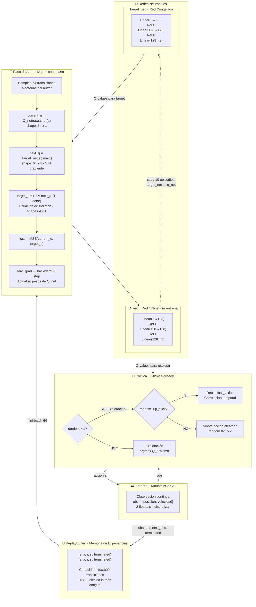
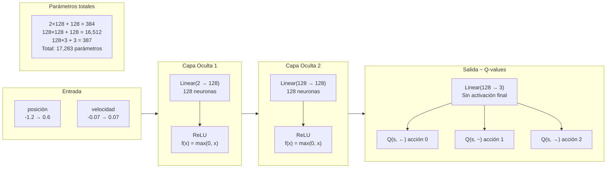
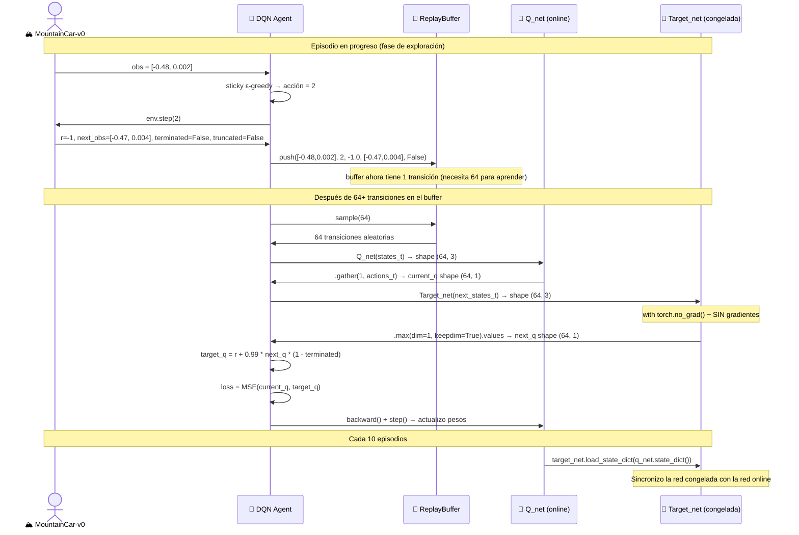
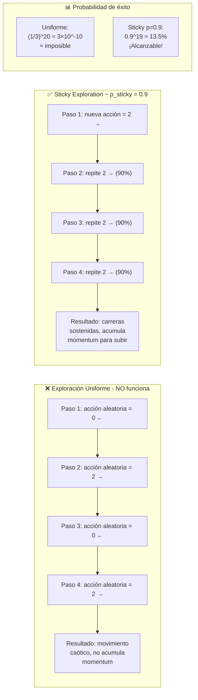

# Diagrama de Arquitectura ~ Ciclo de Entrenamiento DQN

> **Entregable:** Esquema propio del proceso de entrenamiento de DQN ~ "Deep Q-Network ~
> Red Q Profunda" sobre MountainCar-v0, capturando el ciclo completo:
> replay buffer, target network y actualización de Bellman.

---

## Arquitectura General ~ DQN en MountainCar-v0

---

## Detalle ~ La arquitectura de la QNetwork

---

## El ReplayBuffer ~ Cómo funciona la memoria de experiencias

---

## El Bug de Exploración y su Fix ~ Correlación Temporal

---

## Hiperparámetros de entrenamiento ~ DQN

| Parámetro | Símbolo | Valor | Justificación |
|---|:---:|:---:|---|
| Tasa de aprendizaje | α | 0.001 | Adam optimizer ~ más pequeño que Q-Learning tabular |
| Factor de descuento | γ | 0.99 | Mismo que Q-Learning para comparación justa |
| Epsilon inicial | ε₀ | 1.00 | Exploración total al inicio |
| Epsilon mínimo | ε_min | 0.01 | Mantiene exploración residual |
| Decaimiento de epsilon | ε_decay | 0.995 | Más rápido que Q-Learning (menos episodios totales) |
| Tamaño del mini-batch | B | 64 | Balance estabilidad/velocidad estándar en DQN |
| Capacidad del buffer | N | 100,000 | Suficiente diversidad de experiencias |
| Frecuencia sync target | f | 10 episodios | Estabilidad sin desactualización excesiva |
| Neuronas por capa | h | 128 | Red pequeña suficiente para espacio 2D |
| Probabilidad sticky | p_sticky | 0.9 | Fix de exploración ~ carreras sostenidas de ~10 pasos |
| Episodios de entrenamiento | T | 2,500 | Convergencia esperada según documentación |
