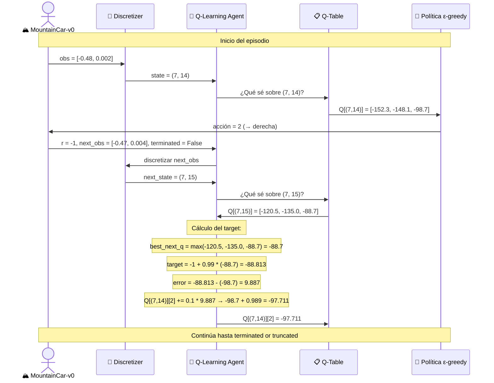
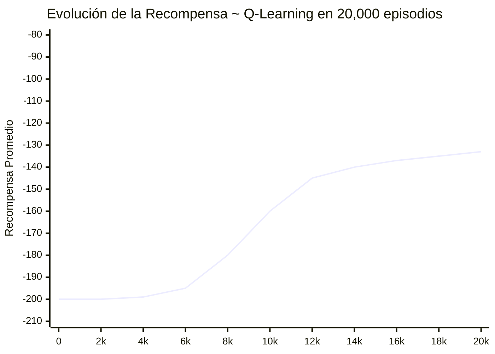

# Diagrama de Arquitectura ~ Ciclo de Entrenamiento Q-Learning

> **Entregable:** Esquema propio del proceso de entrenamiento de Q-Learning tabular
> sobre MountainCar-v0, capturando el ciclo completo:
> estado → acción → recompensa → actualización de la Q-Table.

---

## Arquitectura General ~ Q-Learning Tabular en MountainCar-v0

```mermaid
flowchart LR
    subgraph ENV["🏔️ Entorno ~ MountainCar-v0"]
        direction TB
        E1["Estado Continuo\nposición ∈ [-1.2, 0.6]\nvelocidad ∈ [-0.07, 0.07]"]
        E2["Recompensa\nr = -1 por paso"]
        E3["Condición de término\nposición ≥ 0.5\nO 200 pasos"]
    end

    subgraph DISC["🔢 Discretización"]
        direction TB
        D1["np.digitize(posición, bordes)\n→ índice 0..19"]
        D2["np.digitize(velocidad, bordes)\n→ índice 0..19"]
        D3["Estado discreto\n= (idx_pos, idx_vel)\n400 estados totales"]
        D1 --> D3
        D2 --> D3
    end

    subgraph AGENT["🤖 Agente Q-Learning"]
        direction TB
        subgraph POL["Política ε-greedy"]
            P1{random < ε?}
            P2["Exploración\nacción aleatoria\n0, 1 o 2"]
            P3["Explotación\nargmax Q-Table-estado"]
            P1 -- SI --> P2
            P1 -- NO --> P3
        end

        subgraph QTBL["Q-Table ~ Memoria del Agente"]
            Q1["Estado (0,0) → [Q₀, Q₁, Q₂]"]
            Q2["Estado (7,14) → [-152, -148, -99]"]
            Q3["Estado (10,9) → [Q₀, Q₁, Q₂]"]
            Q4["... 400 estados posibles ..."]
        end

        subgraph UPD["Actualización TD ~ Temporal Difference"]
            U1["target = r + γ · max Q(s')"]
            U2["error = target - Q(s, a)"]
            U3["Q(s, a) += α · error"]
            U1 --> U2 --> U3
        end
    end

    ENV -- "obs: [pos, vel]" --> DISC
    DISC -- "state: (idx, idx)" --> POL
    P2 -- "acción a" --> ENV
    P3 -- "acción a" --> ENV
    ENV -- "r, s', terminated" --> UPD
    DISC -- "state, next_state" --> UPD
    UPD -- "actualiza tabla" --> QTBL
    QTBL -- "Q-values" --> POL
```

---

## Detalle ~ La Q-Table y el proceso de actualización

---

## El proceso de aprendizaje a lo largo del tiempo

> **Nota:** La curva real se generará con matplotlib después del entrenamiento
> y se guardará en `docs/03_resultados/plots/`.

---

## Hiperparámetros de entrenamiento ~ Q-Learning

| Parámetro | Símbolo | Valor | Justificación |
|---|:---:|:---:|---|
| Número de bins por dimensión | n_bins | 20 | 400 estados totales: granularidad óptima |
| Tasa de aprendizaje | α | 0.10 | Actualización conservadora para estabilidad |
| Factor de descuento | γ | 0.99 | Recompensas futuras casi tan valiosas como inmediatas |
| Epsilon inicial | ε₀ | 1.00 | Exploración total al inicio (el agente no sabe nada) |
| Epsilon mínimo | ε_min | 0.01 | Siempre mantiene 1% de exploración residual |
| Decaimiento de epsilon | ε_decay | 0.9995 | Decaimiento lento: llega a ε_min en ~20,000 episodios |
| Episodios de entrenamiento | T | 20,000 | Convergencia típica según documentación del proyecto |
