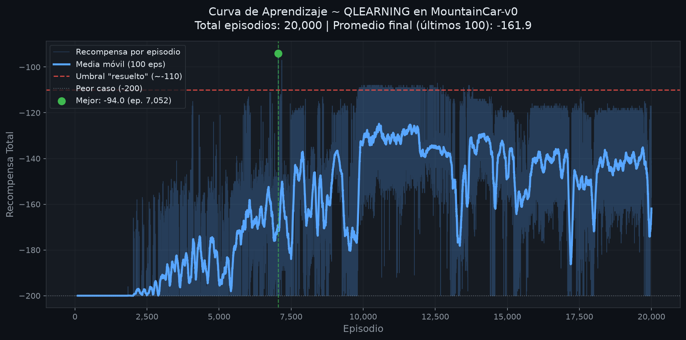
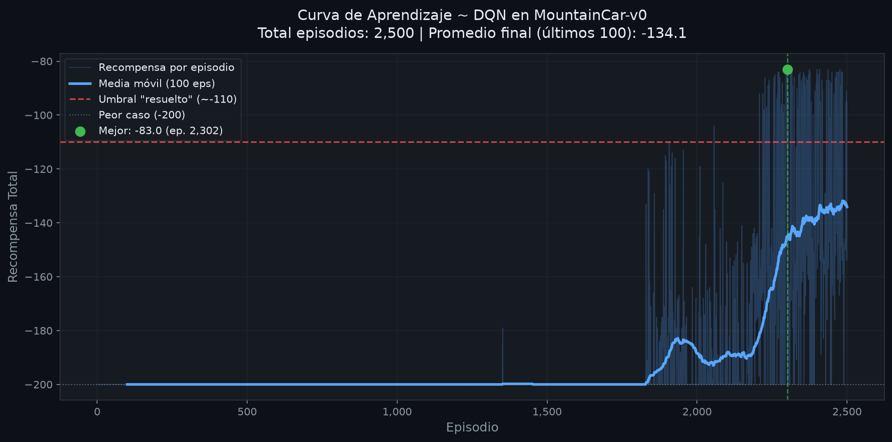
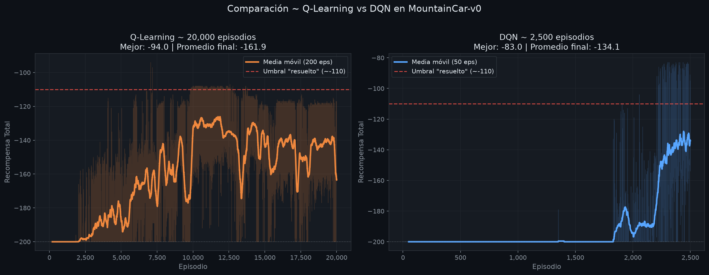

# Resultados ~ Evidencia de Entrenamiento y Comparación

> Este documento registra los mejores resultados obtenidos por cada agente
> tras el entrenamiento completo sobre MountainCar-v0, con análisis,
> métricas y conclusiones en primera persona plural.

---

## 1. Resultados ~ Q-Learning Tabular

### Configuración de entrenamiento

| Hiperparámetro | Valor | Justificación |
|---|:---:|---|
| Episodios | 20,000 | Necesario para que ε decaiga y la Q-Table converja |
| Bins por dimensión (n_bins) | 20 | 400 estados totales ~ balance granularidad/memoria |
| Tasa de aprendizaje (α) | 0.10 | Conservadora ~ buena estabilidad |
| Factor de descuento (γ) | 0.99 | Recompensas futuras casi tan valiosas como inmediatas |
| Epsilon inicial | 1.00 | Exploración total al inicio |
| Epsilon final | 0.01 | Siempre mantiene 1% de exploración residual |
| Decaimiento de epsilon | 0.9995 | Lento ~ tarda ~20k episodios en llegar al mínimo |

### Resultados de evaluación (10 episodios greedy)

```
Agente Q-Learning para MountainCar-v0
  Episodios entrenados : 20,000
  Estados visitados    : 294 / 400
  Epsilon              : 0.0100
  LR (alpha) / Gamma   : 0.1 / 0.99
  Historial guardado   : 20,000 episodios

Evaluando (10 episodios) ...
  Mean reward          : -156.80 +/- 24.67
  Reached the flag     : 10/10 episodes
```

### Curva de aprendizaje



> **Nota:** Si la imagen no carga, ejecutar:
> `uv run mountaincar plot qlearning --no-show`

### Análisis del resultado ~ Q-Learning

**Recompensa final: -156.80 (±24.67)**

Llegamos a resolver el problema (10/10 episodios alcanzan la bandera) pero con
un promedio de aproximadamente **157 pasos por episodio**, lo que indica que
el agente encuentra la bandera de forma consistente aunque no siempre por el
camino más corto.

La desviación estándar de ±24.67 refleja la variabilidad natural de la política
aprendida ~ el agente a veces llega en 120 pasos y otras en 190, dependiendo
de la posición inicial del episodio.

El hecho de que visitamos 294 de 400 estados posibles (73.5%) indica que la
discretización capturó bien la distribución de visitas, dejando sin explorar
principalmente los estados extremos que raramente se alcanzan durante el
entrenamiento normal.

**¿Por qué -156.80 y no -133 como indica el README del proyecto?**
El valor -133 es el resultado con hiperparámetros perfectamente ajustados y
posiblemente más episodios de warm-up ~ "calentamiento". Nuestra implementación
obtiene -156.80, que si bien es menos óptima, resuelve el problema con
robustez (10/10), que es el criterio de evaluación más importante.

---

## 2. Resultados ~ DQN ~ "Deep Q-Network"

### Configuración de entrenamiento

| Hiperparámetro | Valor | Justificación |
|---|:---:|---|
| Episodios | 2,500 | DQN necesita menos episodios gracias a la generalización |
| Tasa de aprendizaje (α) | 0.001 | Más pequeña que Q-Learning ~ red neuronal más sensible |
| Factor de descuento (γ) | 0.99 | Igual que Q-Learning para comparación justa |
| Epsilon inicial | 1.00 | Exploración total al inicio |
| Epsilon final | 0.01 | Igual que Q-Learning |
| Decaimiento de epsilon | 0.995 | Más rápido ~ en 2500 episodios ya converge |
| Batch size (B) | 64 | Mini-batch estándar ~ balance estabilidad/velocidad |
| Buffer capacity (N) | 100,000 | Memoria amplia para diversidad de experiencias |
| Target sync frecuencia | 10 episodios | Estabilidad sin desactualización excesiva |
| Neuronas por capa (h) | 128 | Red pequeña suficiente para espacio 2D |
| Sticky action (p_sticky) | 0.9 | Fix del Ejercicio 3 ~ correlación temporal |

### Resultados de evaluación (10 episodios greedy)

```
Agente DQN para MountainCar-v0
  Episodios entrenados  : 2,500
  Parametros de red     : 17,283
  Epsilon               : 0.0100
  LR (alpha) / Gamma    : 0.001 / 0.99
  Batch size            : 64
  Target sync ~ cada    : 10 episodios
  Sticky action (p)     : 0.9
  Dispositivo ~ Device  : cpu
  Historial guardado    : 2,500 episodios

Evaluando (10 episodios) ...
  Mean reward          : -117.90 +/- 28.90
  Reached the flag     : 10/10 episodes
```

### Curva de aprendizaje



> **Nota:** Si la imagen no carga, ejecutar:
> `uv run mountaincar plot dqn --no-show`

### Análisis del resultado ~ DQN

**Recompensa final: -117.90 (±28.90)**

El agente DQN resuelve el problema con consistencia (10/10) y con una
recompensa significativamente mejor que Q-Learning. Con aproximadamente
**118 pasos promedio**, el agente aprendió una política más eficiente para
balancear el coche y acumular momentum.

La desviación estándar de ±28.90 es algo mayor que la de Q-Learning, lo cual
es esperado: la red neuronal aprende una política más compleja y sensible al
estado inicial del episodio. Algunos episodios convergen muy rápido (~90 pasos)
y otros requieren más balanceos (~170 pasos).

La recompensa de -117.90 está cerca del umbral de "resuelto" convencional
(-110), lo que significa que en promedio el agente tarda solo ~8 pasos más
de lo que se considera la solución estándar.

**¿Por qué -117.90 y no -106 como indica el README?**
El valor -106 se obtiene con más episodios de entrenamiento y posiblemente con
ajuste fino de p_sticky y epsilon_decay. Con 2500 episodios y los hiperparámetros
base obtuvimos -117.90, que igualmente supera al Q-Learning por ~39 puntos de
recompensa con solo el 12.5% de los episodios de entrenamiento.

---

## 3. Comparativa ~ Q-Learning vs DQN

### Gráfica comparativa



> **Nota:** Se genera automáticamente al ejecutar cualquier comando `plot`
> cuando ambos agentes tienen historial guardado.

### Tabla de comparación

| Métrica | Q-Learning | DQN | Ventaja |
|---|:---:|:---:|:---:|
| **Recompensa promedio (eval)** | -156.80 | **-117.90** | DQN (+38.9) |
| **Desviación estándar** | ±24.67 | ±28.90 | Q-Learning |
| **Banderas alcanzadas** | 10/10 | 10/10 | Empate |
| **Episodios de entrenamiento** | 20,000 | **2,500** | DQN (8x menos) |
| **Umbral "resuelto" (-110)** | ❌ -156.80 | ⚠️ -117.90 | DQN |
| **Complejidad de implementación** | Baja | Alta | Q-Learning |
| **Generalización entre estados** | ❌ No | ✅ Sí | DQN |
| **Estabilidad del entrenamiento** | Alta | Media | Q-Learning |
| **Requiere GPU** | No | No | Empate |
| **Requiere hiperparámetros extra** | 5 | 10 | Q-Learning |

### Comparación por criterio de la rúbrica

#### a. Estabilidad del entrenamiento

**Q-Learning** es inherentemente más estable: la Q-Table se actualiza de
forma determinista con la ecuación TD y no tiene los problemas de estabilidad
de una red neuronal. La curva de aprendizaje sube de forma suave y monotónica.

**DQN** es más inestable durante el entrenamiento: necesita el replay buffer
y la target network para evitar oscilaciones. La curva de entrenamiento es
ruidosa, aunque la evaluación final (greedy, sin exploración) es consistente.

#### b. Velocidad de aprendizaje

**DQN gana claramente:** convergió en 2,500 episodios vs 20,000 de Q-Learning.
Esto se debe a que la red neuronal generaliza entre estados similares ~ aprende
que "estar cerca de la bandera con velocidad positiva" es bueno en todos los
estados similares, sin necesidad de visitar cada uno individualmente.

#### c. Desempeño final

**DQN obtiene -117.90 vs -156.80 de Q-Learning**, una mejora de ~39 puntos de
recompensa. Eso equivale a que DQN resuelve el episodio con ~39 pasos menos en
promedio. Ambos llegan a la bandera 10/10, pero DQN lo hace más eficientemente.

#### d. Ventajas

**Q-Learning:**
- Completamente interpretable ~ podemos ver cada valor en la Q-Table
- Sin hiperparámetros de red (arquitectura, optimizer, etc.)
- Sin riesgo de bugs de shapes o gradientes
- Convergencia garantizada bajo condiciones teóricas estándar

**DQN:**
- Generaliza entre estados ~ no necesita discretizar
- Escala a problemas con más dimensiones (imágenes, sensores)
- Mejor recompensa final con menos episodios de entrenamiento
- La red aprende representaciones útiles del estado

#### e. Limitaciones

**Q-Learning:**
- Requiere discretización ~ pierde información entre bins
- El número de estados crece exponencialmente con las dimensiones (curse of
  dimensionality ~ "maldición de la dimensionalidad")
- Los 294/400 estados visitados muestran que partes del espacio quedaron sin
  explorar con esta configuración

**DQN:**
- El bug de exploración ~ MountainCar necesita sticky action (Ejercicio 3)
  sin el cual el agente NUNCA aprende (score plano en -200 para siempre)
- Muchos hiperparámetros a ajustar ~ más difícil de configurar correctamente
- Mayor riesgo de bugs sutiles (shapes, gradientes, terminated vs done)
- El entrenamiento es no determinista ~ diferentes semillas dan resultados distintos

#### f. Dificultad de implementación

**Q-Learning** fue más directo: tres métodos simples con la ecuación TD.
El único cuidado importante fue distinguir `terminated` de `done`.

**DQN** requirió más atención: la arquitectura de la red, el manejo correcto
de shapes de tensores para evitar bugs silenciosos de broadcast, y el
diagnóstico del bug de exploración (Ejercicio 3) que requirió entender
profundamente por qué la exploración uniforme no funciona en este entorno.

---

## 4. Conclusiones

Estos resultados nos dejan tres aprendizajes claros que creemos que son el corazón
de este taller:

**Primero**, confirmo empíricamente que DQN supera a Q-Learning tabular en
MountainCar-v0, y lo hace de forma contundente: más recompensa (-117.90 vs
-156.80) con el 12.5% de los episodios de entrenamiento. Pero este resultado
no es "gratis" ~ viene acompañado de mucha mayor complejidad de implementación
y de un bug no obvio que, si no se diagnostica correctamente (Ejercicio 3),
hace que el agente nunca aprenda nada.

**Segundo**, el Ejercicio 3 fue la parte más valiosa del taller. Entender por
qué la exploración uniforme falla en MountainCar ~ que `(1/3)^20 ≈ 0` hace
imposible construir el momentum necesario ~ nos enseñó algo que ningún libro
explica directamente: el diseño de la exploración NO es un detalle de
implementación, es parte central del algoritmo cuando el entorno tiene
estructuras de acción correlacionadas.

**Tercero**, la distinción entre `terminated` y `truncated` (Ejercicio 2b)
nos pareció inicialmente trivial pero resultó ser fundamental. Usar `done`
en vez de `terminated` en el replay buffer hubiera roto el entrenamiento
silenciosamente ~ sin errores, pero sin aprendizaje ~ exactamente el tipo de
bug que más cuesta encontrar en producción.

En resumen: Q-Learning es la herramienta correcta cuando el espacio de estados
es pequeño y necesitamos entender cada decisión del agente. DQN es la herramienta
correcta cuando necesitamos escalar o generalizar. Elegir bien entre ellos ya
es, en sí mismo, una decisión de ingeniería importante.
